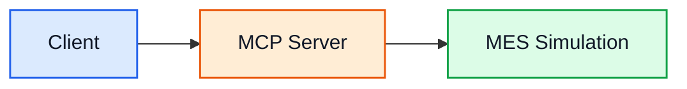
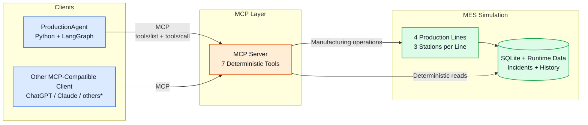
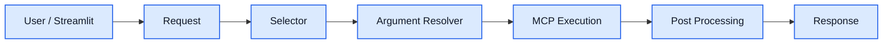
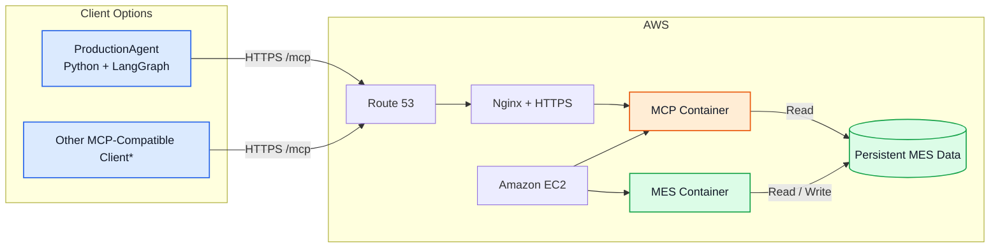
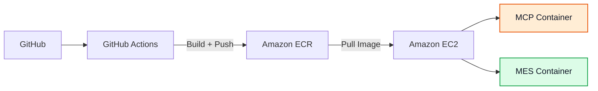

# ShopfloorAgent

ShopfloorAgent is a manufacturing AI prototype built around three clear layers:

- **Client** — our Python/LangGraph ProductionAgent or another MCP-compatible client
- **MCP Server** — a deterministic tool layer exposing manufacturing capabilities
- **MES Simulation** — the production-system source of truth for runtime state, incidents, repairs, and production history

The MCP layer is intentionally independent from the conversational client, allowing the same manufacturing capabilities to be reused by different MCP-compatible applications.

> **LLMs interpret language. Deterministic Python and the MES own production truth, validation, and calculations.**

### Diagram colors

- **Blue** — Client / AI layer
- **Orange** — MCP boundary
- **Green** — MES / production truth
- Infrastructure remains neutral to keep the diagrams readable.

---

## 1. Core idea



---

## 2. Expanded architecture



\* External clients are examples where MCP connectivity is supported and configured.

---

## 3. Manufacturing simulation

The MES is not only a database behind an AI application. It provides a deterministic manufacturing environment that can be investigated through MCP.

- **4 parallel production lines**
- **3 stations per line**
- deterministic production cycles and simulated timestamps
- **5 reproducible fault scenarios**
- open incidents, repairs, repair comments, and historical incident data
- persistent SQLite production and incident history
- diagnostic incident data retained in the MES backend
- deterministic troubleshooting knowledge

The MES remains the authoritative production system. The LLM does not simulate machine state or manufacture production facts.

---

## 4. ProductionAgent

Our ProductionAgent is one possible MCP client.

It uses Streamlit, Python, LangGraph, and LLM-based language interpretation while keeping tool execution and validation deterministic.



The LangGraph workflow is intentionally small:

```text
REQUEST
  → SELECTOR
  → ARGUMENT_RESOLVER
  → EXECUTION
  → POST_PROCESSING
  → RESPONSE
```

The LLM helps interpret natural-language requests.

Deterministic Python remains responsible for:

- executable tool contracts
- validation
- defaults
- production-data lookups
- production-impact calculations
- MCP execution

---

## 5. MCP tools

The MCP server exposes seven focused manufacturing capabilities:

- `get_status`
- `get_production_statistics`
- `list_prior_incidents`
- `get_incident_details`
- `get_resolution_instructions`
- `get_repair_experience`
- `calculate_production_impact`

The tools expose structured deterministic results through a real **Streamable HTTP MCP server**.

MCP is therefore both an execution boundary and a reusable interface between the production system and AI clients.

---

## 6. Local and AWS deployment

The same architecture can run locally or with MES + MCP deployed remotely on AWS.



\* Where MCP connectivity is supported and configured by the client.

For the AWS deployment, the **ProductionAgent remains client-side**, while MES and MCP run remotely and are accessed through HTTPS.

---

## 7. CI/CD

The project also includes a deployment path from source code to the AWS runtime.



The deployed runtime includes:

- Docker
- Amazon ECR
- Amazon EC2
- GitHub Actions
- persistent MES storage
- Nginx
- HTTPS/TLS
- Route 53
- systemd startup

---

## 8. What was implemented

The project combines:

- deterministic manufacturing simulation
- persistent production and incident history
- deterministic fault and repair scenarios
- seven MCP manufacturing tools
- real Streamable HTTP MCP communication
- Python + LangGraph agent orchestration
- LLM-based natural-language interpretation
- deterministic argument validation
- structured conversational context
- local development environment
- Docker containerization
- AWS deployment
- HTTPS public MCP endpoint
- GitHub Actions CI/CD

The latest verified automated test checkpoint is:

```text
75 passed, 25 subtests passed
```

---

## Design principles

**MES owns production truth.**

**MCP exposes deterministic capabilities.**

**LLMs interpret language rather than manufacturing reality.**

**Executable arguments are validated before tool execution.**

**The conversational client can be replaced without redesigning the MES.**

**Local and cloud deployments preserve the same logical MCP boundary.**

---

## In one sentence

**ShopfloorAgent demonstrates how deterministic manufacturing systems can expose production knowledge and operations to modern AI applications through a reusable MCP interface while keeping production truth outside the language model.**
